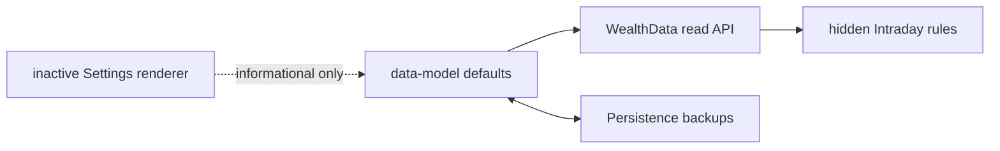

# Settings Dependency and Impact Graph

Changing either value affects only the hidden Intraday discipline calculations and backup content. Changing the renderer has no calculation or persistence impact.
